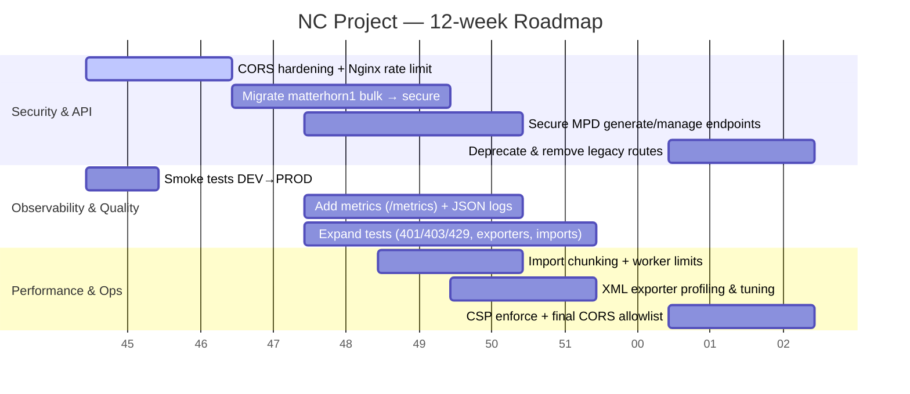

# NC Project — Comprehensive Codebase Overview and Findings (Updated)

Authoring context: repository at C:\\Users\\pawlo\\Desktop\\kodowanie\\nc_project (codebase "nc_project")

## 0) Executive Overview

NC Project is a Django 5.x, multi-app system comprising:

- Apps: MPD (catalog, XML exports, legacy tables), matterhorn1 (bulk ingestion/sync endpoints), web_agent (task runner with DRF ViewSets)
- Multi-DB: dedicated Postgres databases per app with explicit routers and prod/dev variants (e.g., MPD/zzz_MPD)
- Asynchronous processing: Celery workers and queues (default, import, ml) with Redis broker/result
- Edge and static: Nginx in front; WhiteNoise fall-back in prod; Docker Compose stacks for dev and prod; optional S3/MinIO storage
- Security posture: DRF default auth/permissions/throttling enabled globally; secure DRF endpoints added alongside legacy csrf_exempt views; Nginx security headers and CSP (report-only) configured

This document consolidates current structure and settings verified directly from the codebase, highlights gaps, and provides actionable notes for implementation and hardening.

---

## 1) Current Knowledge

### 1.1 Project structure and entry points

- Entry points
  - manage.py — Django CLI runner (default DJANGO_SETTINGS_MODULE is set via environment/compose)
  - nc/urls.py — root URL router with i18n; mounts:
    - /mpd/ → MPD.urls
    - /matterhorn1/ → matterhorn1.urls
    - /web_agent/ → web_agent.urls
    - optional drf-spectacular docs: /api/schema, /api/docs, /api/redoc (if installed)
    - fallback static serving via django for convenience always appended in urls
- Celery
  - nc/celery.py — Celery app configuration, autodiscovery, queues routing, and worker tuning
- Settings
  - nc/settings/base.py — common config (env loading, INSTALLED_APPS incl. rest_framework.authtoken, DBs, routers, DRF defaults, S3 storage conditional, Redis cache)
  - nc/settings/dev.py — dev overrides (DEBUG=True, permissive CORS/CSRF, Redis dev URLs, Debug Toolbar)
  - nc/settings/prod.py — prod overrides (DEBUG=False, secure cookies, CORS allows all, WhiteNoise fallback, Redis/Celery env-based)

### 1.2 API surface (from urls modules)

- matterhorn1 (matterhorn1/urls.py)
  - All under /matterhorn1/api/ ...
  - Products bulk:
    - products/bulk/ (View)
    - products/bulk/create/ (legacy, csrf_exempt)
    - products/bulk/update/ (legacy, csrf_exempt)
    - products/bulk/create-secure/ (DRF APIView, IsAuthenticated)
    - products/bulk/update-secure/ (DRF APIView, IsAuthenticated)
  - Variants bulk:
    - variants/bulk/
    - variants/bulk/create/ (legacy)
    - variants/bulk/update/ (legacy)
    - variants/bulk/create-secure/ (DRF, IsAuthenticated)
    - variants/bulk/update-secure/ (DRF, IsAuthenticated)
  - Brands & Categories bulk:
    - brands/bulk/, brands/bulk/create/ (legacy)
    - brands/bulk/create-secure/ (DRF, IsAuthenticated)
    - categories/bulk/, categories/bulk/create/ (legacy)
    - categories/bulk/create-secure/ (DRF, IsAuthenticated)
  - Images bulk:
    - images/bulk/, images/bulk/create/ (legacy)
    - images/bulk/create-secure/ (DRF, IsAuthenticated)
  - Sync & status:
    - sync/ (legacy), sync/products/, sync/variants/
    - sync/secure/ (DRF, IsAdminUser placeholder)
    - status/, logs/
  - Product details:
    - products/<int:product_id>/ (legacy, csrf_exempt)

- MPD (MPD/urls.py)
  - DRF router: /mpd/product-sets/ → ProductSetViewSet (actions include add/remove products, list)
  - Functional endpoints (many csrf_exempt):
    - Products pages and utilities: products/, product-mapping/, test-connection/, test-structure/
    - XML generation and retrieval:
      - export-xml/<source_name>/, export-full-xml/ (deprecated), generate-full-xml/ (legacy), generate-full-xml-secure/ (DRF APIView IsAdminUser)
      - generate-\*: full-change, light, producers, stocks, units, categories, sizes, parameters, series, warranties, preset (various)
      - generate-gateway-xml/<source_name>/, generate-gateway-xml-api/
      - get-xml/<xml_type>/, get-gateway-xml/, xml-links/
    - Product management:
      - manage-product-paths, manage-product-attributes, manage-product-fabric
      - create-product, products/<id>, products/<id>/update
      - bulk-create
      - matterhorn1 integration: matterhorn1/products, matterhorn1/bulk-map
      - update-producer-code

- web_agent (web_agent/urls.py)
  - /web_agent/api/ via DRF DefaultRouter:
    - tasks (WebAgentTaskViewSet: custom actions start, stop, update_status, stats)
    - logs (ReadOnly)
    - configs (CRUD)

Notes:

- DRF default permissions/auth apply to DRF views (secure endpoints and web_agent), not to legacy function-based views decorated with csrf_exempt.

### 1.3 Key domain models (high-level)

- matterhorn1/models.py (not fully enumerated here): Product, Brand, Category, ProductVariant, ProductImage, ApiSyncLog, etc.
- MPD/models.py (legacy-mapped tables): Products, ProductVariants, Sizes, Colors, Paths, Attributes, Brands, ProductSet, etc.
- web_agent/models.py: WebAgentTask, WebAgentLog, WebAgentConfig

### 1.4 Tasks and batch processing

- Celery queues (nc/celery.py)
  - Queue routing:
    - web_agent.tasks.generate_embeddings/semantic_search/... → ml
    - matterhorn1.tasks.full_import_and_update → import
    - matterhorn1.tasks._, MPD.tasks._, web_agent.tasks.\* → default by pattern
  - Settings: acks_late True; worker heartbeat disabled; prefetch 1; disable rate limits; retry settings, transport options tuned

### 1.5 Dependencies (requirements.txt)

- Django==5.2.4, djangorestframework==3.16.0, drf-spectacular==0.28.0
- Celery==5.4.0 (+ django-celery-beat==2.8.0, django-celery-results==2.5.1)
- django-redis==5.4.0, redis==5.2.1
- gunicorn==23.0.0
- boto3/botocore, pillow, lxml, requests, rapidfuzz, etc.
- Dev/ops extras: debug_toolbar, flower, whitenoise, corsheaders

### 1.6 Configuration and environment

- Environment loading via python-dotenv based on DJANGO_SETTINGS_MODULE suffix (dev/prod)
- Databases (base.py): default, zzz_default, MPD, zzz_MPD, matterhorn1, zzz_matterhorn1, web_agent, zzz_web_agent (Postgres)
- Routers (nc/db_routers.py): MPDRouter, WebAgentRouter, Matterhorn1Router, DefaultRouter
- DRF (base & prod):
  - DEFAULT_AUTHENTICATION_CLASSES: SessionAuthentication, TokenAuthentication
  - DEFAULT_PERMISSION_CLASSES: IsAuthenticated
  - DEFAULT_THROTTLE_RATES: user 1000/day, anon 100/day, bulk 60/min
- Storage (optional): S3Boto3 when AWS_STORAGE_BUCKET_NAME is set (MinIO compatible via env)
- Cache: Redis (django-redis in prod, core RedisCache fallback in base)
- Security (prod.py): DEBUG=False; session/csrf cookies secure; ALLOWED_HOSTS include VPS IP; CSRF_TRUSTED_ORIGINS listed; CORS_ALLOW_ALL_ORIGINS=True (broad)

### 1.7 Testing

- web_agent/tests.py: extensive API/model tests (26 test methods found via graph)
- Root tests: test_gateway.py, test_gateway_fix.py (XML/gateway flows)

### 1.8 Ops and deployment

- Docker Compose (dev):
  - Services: web (gunicorn --reload), nginx (8080→80), redis (localhost:6380), celery-default, celery-import, celery-beat, flower (5555)
  - Volumes for staticfiles, celery, flower; .env.dev; runs migrations against zzz_default
- Docker Compose (prod):
  - Services: postgres 18-alpine, web (gunicorn, migrations to specific DBs), nginx (80/443), celery-\* workers/beat, flower
  - Redis with requirepass; resource limits on celery; .env.prod
  - S3/MinIO env variables wired into web & workers
- Nginx (nginx.conf):
  - Security headers: X-Frame-Options DENY, nosniff, Referrer-Policy, Permissions-Policy, CSP Report-Only
  - Proxies to web:8000; serves /static from /app/staticfiles

---

## 2) Knowledge Gaps / Open Questions

- Legacy endpoints security: Large number of csrf_exempt function-based views (MPD, matterhorn1) bypass CSRF and do not enforce DRF auth. What is the client matrix using these routes? Can we migrate them to the secure DRF counterparts and then retire the legacy ones?
- CORS in prod: Currently CORS_ALLOW_ALL_ORIGINS=True. Is this intentional? If not, specify allowed origins and switch to an allowlist.
- Observability: Central metrics/log aggregation not present by default. Confirm need for /metrics (Prometheus) and structured JSON logs.
- S3/MinIO: Confirm production storage provider, bucket policy, and whether media/user uploads are required (current usage is mostly XML artifacts).
- SLA expectations: Throughput for bulk endpoints and XML generation, and acceptable task durations on import queue.

---

## 3) New Findings and Deep Dive

### 3.1 High-level architecture

```mermaid
flowchart LR
  subgraph Client
    U[Browser/API Client]
  end

  subgraph Edge
    Nginx[Nginx 80/443 \n CSP report-only, security headers]
  end

  subgraph Django[NC Django App]
    direction TB
    NC[nc (urls, settings)]
    A1[App: MPD]
    A2[App: matterhorn1]
    A3[App: web_agent]
  end

  subgraph Workers[Celery]
    Wdef[Worker: default]
    Wimp[Worker: import]
    Wml[Worker: ml]
    Beat[Celery Beat]
    Flower[Flower]
  end

  subgraph Storage
    S3[(MinIO/S3 optional)]
    REDIS[(Redis broker/result/cache)]
    DBdef[(Postgres: default/zzz_default)]
    DBmpd[(Postgres: MPD/zzz_MPD)]
    DBmh[(Postgres: matterhorn1/zzz_matterhorn1)]
    DBwa[(Postgres: web_agent/zzz_web_agent)]
  end

  U --> Nginx --> NC
  NC <---> A1 & A2 & A3

  Wdef & Wimp & Wml <--> REDIS
  Beat --> REDIS
  Flower --> REDIS

  NC <-- DBdef
  A1 <-- DBmpd
  A2 <-- DBmh
  A3 <-- DBwa
  A1 & A2 & A3 --> S3
```

### 3.2 REST and admin functionality

- matterhorn1
  - Bulk create/update for products, variants, brands, categories, images
  - Secure DRF equivalents exist (IsAuthenticated) for core bulk routes; sync secure placeholder (IsAdminUser)
  - Status/logs endpoints expose basic info (to be implemented)
- MPD
  - Rich set of XML exporters (full, full-change, light, producers, stocks, units, categories, sizes, preset, parameters/series/warranties placeholders)
  - GenerateFullXMLSecure (DRF, IsAdminUser) adds a protected path; legacy generate\_\* endpoints remain csrf_exempt
  - Product management helpers (paths, attributes, fabric, create/update/get, bulk map from matterhorn1)
- web_agent
  - DRF-first ViewSets with authentication enforced; lifecycle actions on tasks; stats endpoint aggregates task counts

### 3.3 Saga/transaction orchestration (matterhorn1)

- matterhorn1/saga.py defines orchestration primitives: SagaStep, SagaStatus, SagaResult, SagaOrchestrator, SagaService
- Intended for cross-DB operations and compensation patterns (actual usage not enumerated in this pass)

### 3.4 XML export pipeline (MPD/export_to_xml.py)

- Exporter classes and key methods identified:
  - FullXMLExporter: export_full, export_incremental, generate_navigation_xml, generate_xml, save_full_record
  - FullChangeXMLExporter: generate_navigation_xml, generate_xml, has_products_to_export, save_full_change_record
  - LightXMLExporter: export, export_incremental, \_generate_xml_for_products, generate_xml
  - GatewayXMLExporter: multiple _create_\* helpers, generate_xml
  - CategoriesXMLExporter, SizesXMLExporter, ProducersXMLExporter, StocksXMLExporter, UnitsXMLExporter

### 3.5 Performance hotspots and complexity signals

- Long functions (200+ LOC) include:
  - matterhorn1.tasks.full_import_and_update (~215 LOC)
  - MPD.tasks.update_stock_from_matterhorn1 (~282 LOC)
  - Various static JS helpers (admin/js, matterhorn1 components) — less critical for backend perf
- Heavy exporters: FullXMLExporter/LightXMLExporter perform large queries and file IO; consider instrumentation and memory caps for workers

### 3.6 Security posture (current)

- DRF defaults (base/prod): Session + Token auth, IsAuthenticated global, throttling incl. scope "bulk"
- Secure endpoints present:
  - matterhorn1: .../create-secure, .../update-secure, /sync/secure (DRF)
  - MPD: /mpd/generate-full-xml-secure/ (DRF IsAdminUser)
- Legacy endpoints: Numerous csrf_exempt function-based views remain (both MPD and matterhorn1) and are not covered by DRF permission enforcement; CSRF is explicitly bypassed
- Nginx: Security headers set incl. CSP-Report-Only; error_log level warn
- Prod settings: DEBUG=False; secure cookies; CSRF_TRUSTED_ORIGINS restricted to VPS IP; CORS_ALLOW_ALL_ORIGINS=True (broad)

Risk summary:

- Until legacy routes are migrated/retired, unauthenticated writes/reads may be possible via csrf_exempt endpoints. DRF-secure routes are available for migration.

### 3.7 Multi-DB routing specifics

- Routers:
  - MPDRouter: routes app_label 'MPD' to MPD (prod) or zzz_MPD (if present)
  - WebAgentRouter: routes 'web_agent' to web_agent or zzz_web_agent
  - Matterhorn1Router: routes 'matterhorn1' to zzz_matterhorn1 or matterhorn1
  - DefaultRouter: routes Django system apps/admin/celery apps to default or zzz_default
- Allow relations broadly True in some routers; migrations allowed only on their target DBs per env

### 3.8 Tests overview

- web_agent/tests.py covers:
  - Model tests (str representations, creation, status choices)
  - API CRUD and lifecycle: create/list/retrieve/update/delete tasks/configs/logs; start/stop; stats; update_status
- XML/gateway tests exist at repo root (manual scripts/test files)

---

## 4) Actionable Implementation Notes (for AI coding agents)

- Adding secure endpoints:
  - Prefer DRF APIView/ViewSet under matterhorn1 and MPD for any new routes; set appropriate permission_classes (IsAuthenticated / IsAdminUser), throttle_scope='bulk' where appropriate
  - Mirror legacy payload contracts to ease client migration

- Migrating legacy endpoints:
  - For each csrf_exempt function-based view, create a DRF equivalent
  - Gate by IsAuthenticated; for admin-only flows (XML generation, DB-manipulating ops) use IsAdminUser
  - Keep legacy routes during migration; plan deprecation timeline and telemetry for usage

- Celery tasks:
  - Route heavy imports to 'import'; ML tasks to 'ml'; others to 'default'
  - Use acks_late with idempotency; instrument time and memory; set max-memory-per-child on prod workers (already present)

- Storage/Artifacts:
  - Use S3Boto3 when AWS\_\* present; for XML, keep local debug copies as established; ensure bucket URL return values are consistent for clients

- DRF schema/docs:
  - If drf-spectacular installed, annotate secure endpoints; expose schema at /api/schema; keep component tags consistent

- Multi-DB access:
  - Use .using('MPD') etc. for legacy tables; adhere to routers; avoid cross-DB FKs; leverage transaction boundaries sensibly

---

## 5) Recommendations and Next Steps

1. Complete migration to secure endpoints (High)

- Prioritize matterhorn1 bulk create/update and MPD management endpoints
- Add IsAdminUser to XML generation and DB mutation routes; retire csrf_exempt once clients switch

2. Tighten CORS in production (High)

- Replace CORS_ALLOW_ALL_ORIGINS=True with an allowlist for known frontends

3. Add observability (Medium)

- Expose Prometheus metrics (/metrics) for HTTP and Celery; gather exporter timings and queue latencies
- Switch to structured JSON logs for web and workers (keep console handlers)

4. Document and test (Medium)

- Expand integration tests for secure endpoints and throttling (429 cases)
- Ensure drf-spectacular schema covers secure routes; publish /api/docs in dev

5. Resource guardrails (Medium)

- For import queue, chunk and backoff; verify worker memory caps; consider task time limits where safe

---

## 6) Source Map (citations)

- URLs
  - nc/urls.py
  - matterhorn1/urls.py
  - MPD/urls.py
  - web_agent/urls.py
- Views (selected)
  - matterhorn1/views.py (legacy + csrf_exempt)
  - matterhorn1/views_secure.py (secure DRF bulk/sync)
  - MPD/views.py (legacy + exporters + management)
  - MPD/views_secure.py (GenerateFullXMLSecure)
  - web_agent/views.py (DRF ViewSets)
- Settings and infra
  - nc/settings/base.py, dev.py, prod.py
  - nc/celery.py, nc/db_routers.py
  - docker-compose.dev.yml, docker-compose.prod.yml
  - nginx.conf
  - env.sample.md
- Exporters
  - MPD/export_to_xml.py

---

## 7) Compressed Summary (TL;DR)

- What: Django 5 multi-app with MPD (XML/catalog), matterhorn1 (bulk ingestion), web_agent (tasks); multi-DB, Celery queues (default/import/ml), Redis, Nginx
- State: DRF defaults (auth/perms/throttling) active; secure DRF endpoints added; legacy csrf_exempt views still present; Nginx headers + CSP report-only; prod DEBUG False
- Risks: Legacy unauthenticated csrf_exempt endpoints; broad CORS in prod
- Next: Migrate to secure endpoints and retire legacy; tighten CORS; add metrics & structured logs; document via drf-spectacular

---

### 3.8 API Security Assessment and Hardening Plan (Delta vs current)

Current improvements already in repo:

- DRF auth/permissions/throttling defaults enabled (Session + Token, IsAuthenticated, scope ‘bulk’)
- Secure DRF endpoints exist for matterhorn1 bulk and sync (IsAuthenticated/IsAdminUser), and MPD GenerateFullXMLSecure (IsAdminUser)
- Nginx security headers added; prod DEBUG=False; secure cookies

Remaining actions:

- Replace legacy csrf_exempt endpoints with DRF equivalents (maintain payloads, add throttling), then remove/expose via secure-only
- Restrict CORS in prod to approved origins
- Add basic edge rate limiting in Nginx for /matterhorn1/api and /mpd/\* sensitive routes (optional)
- Add auth to remaining read endpoints that reveal internal data if required (e.g., get_product_details)
- Expand acceptance tests for 401/403/429 cases and admin-only routes

---

## Appendix A: Implementation Plan (Security, Observability, Testing, Performance)

### A1) Scope and Goals

- Primary: Finish endpoint migration to DRF secure; tighten CORS; add throttling where heavy
- Secondary: Observability (Prometheus metrics, JSON logs)
- Tertiary: Expand tests and coverage on critical flows

### A2) Prioritization (Now → Next → Later)

- Now (Week 0–1): Migrate high-traffic legacy endpoints to DRF; permission them; add throttle scopes; restrict CORS
- Next (Week 2–3): Metrics/logging; rate limits at Nginx; schema docs via drf-spectacular with examples
- Later (Week 4–6): Remove legacy endpoints; backpressure patterns; define SLOs

### A3) Workstreams and Tasks

- S-1: matterhorn1 bulk routes → DRF (already present; migrate clients; deprecate legacy)
- S-2: MPD generate*\* and manage*\* → DRF with IsAdminUser for mutation/exports
- S-3: CORS hardening in prod.py
- O-1: prometheus_client integration; HTTP/Celery metrics; /metrics endpoint
- T-1: Tests for auth/throttle; T-2: Exporters and import queue path tests; T-3: Coverage

### A4) Timeline & Milestones

- M1: All write endpoints protected (Week 1)
- M2: Observability live; docs published (Week 3)
- M3: Legacy endpoints removed (Week 6)

### A5) Risks & Mitigations

- Client breakage → parallel routes + migration window; communicate timeline
- Over-throttling → per-scope tuning; whitelists if needed
- CSP tightening → keep report-only until confident

### A6) Rollout

- Keep secure and legacy in parallel; add server-side telemetry for legacy usage; retire based on inactivity

### A7) Patch Outline (selected snippets already present in repo)

- DRF defaults in settings (base/prod):

```python
REST_FRAMEWORK = {
  'DEFAULT_AUTHENTICATION_CLASSES': [
    'rest_framework.authentication.SessionAuthentication',
    'rest_framework.authentication.TokenAuthentication',
  ],
  'DEFAULT_PERMISSION_CLASSES': ['rest_framework.permissions.IsAuthenticated'],
  'DEFAULT_THROTTLE_RATES': {'user': '1000/day', 'anon': '100/day', 'bulk': '60/min'},
}
```

- Secure exporter endpoint (MPD/views_secure.py): GenerateFullXMLSecure(IsAdminUser)
- matterhorn1 secure DRF APIViews for bulk create/update (IsAuthenticated) and sync (IsAdminUser placeholder)
- Nginx headers and CSP report-only in nginx.conf

---

Footer: Created with Shotgun (https://shotgun.sh)

## Appendix B: Legacy → Secure API Migration Checklist (Action Plan)

### B1) Scope & Goals

- Migrate active callers from legacy csrf_exempt endpoints to secure DRF endpoints with authentication and throttling.
- Restrict production CORS to approved origins.
- Keep legacy routes temporarily for compatibility; remove after migration window.

### B2) Endpoint Mapping and Actions

- matterhorn1 (base path: /matterhorn1/api/)
  - Products
    - legacy: products/bulk/create/ → secure: products/bulk/create-secure/ (IsAuthenticated)
    - legacy: products/bulk/update/ → secure: products/bulk/update-secure/ (IsAuthenticated)
  - Variants
    - legacy: variants/bulk/create/ → secure: variants/bulk/create-secure/ (IsAuthenticated)
    - legacy: variants/bulk/update/ → secure: variants/bulk/update-secure/ (IsAuthenticated)
  - Brands
    - legacy: brands/bulk/create/ → secure: brands/bulk/create-secure/ (IsAuthenticated)
  - Categories
    - legacy: categories/bulk/create/ → secure: categories/bulk/create-secure/ (IsAuthenticated)
  - Images
    - legacy: images/bulk/create/ → secure: images/bulk/create-secure/ (IsAuthenticated)
  - Sync
    - legacy: sync/, sync/products/, sync/variants/ → secure: sync/secure/ (IsAdminUser) [secure stub exists; extend as needed to support products/variants scopes]
  - Status/Logs
    - legacy: status/, logs/ (no auth) → add DRF read endpoints (IsAuthenticated) or IsAdminUser if sensitive
  - Product details
    - legacy: products/<int:product_id>/ → add DRF read-only endpoint (IsAuthenticated) and deprecate legacy view

- MPD (base path: /mpd/)
  - XML generation
    - legacy: generate-full-xml/ → secure: generate-full-xml-secure/ (IsAdminUser)
    - legacy: generate-\*-xml (light, producers, stocks, units, categories, sizes, full-change, preset, parameters, series, warranties) → add secure counterparts (IsAdminUser); keep legacy during migration; optionally protect at Nginx until secure paths exist
  - XML access
    - get-xml/<xml_type>/, get-gateway-xml/ → consider IsAuthenticated (or signed links if public is intended)
  - Product operations
    - manage-product-paths, manage-product-attributes, manage-product-fabric, create-product, products/<id>, products/<id>/update, bulk-create, matterhorn1/\*, update-producer-code → convert to DRF APIViews (IsAdminUser for writes), throttle heavy ops (scope: bulk)

- web_agent
  - Already DRF with IsAuthenticated; no changes needed.

### B3) Authentication & Tokens

- Auth defaults already enabled (Session + Token).
- Provision tokens for machine clients:

```python
from django.contrib.auth import get_user_model
from rest_framework.authtoken.models import Token
u, _ = get_user_model().objects.get_or_create(username='api-client', defaults={'is_active': True})
token, _ = Token.objects.get_or_create(user=u)
print(token.key)
```

- Client header: `Authorization: Token <TOKEN>`

### B4) Production CORS Tightening

- In nc/settings/prod.py replace CORS_ALLOW_ALL_ORIGINS=True with allowlist, e.g.:

```python
CORS_ALLOW_ALL_ORIGINS = False
CORS_ALLOWED_ORIGINS = [
  'https://your-frontend.example',
]
```

### B5) Optional Nginx Rate Limiting

- Example (define limit_req_zone in http{} and apply to sensitive paths):

```nginx
limit_req_zone $binary_remote_addr zone=api:10m rate=10r/s;
location /matterhorn1/api/ { limit_req zone=api burst=20 nodelay; proxy_pass http://web:8000; }
location /mpd/ { limit_req zone=api burst=20 nodelay; proxy_pass http://web:8000; }
```

### B6) Validation (Smoke Tests)

- Unauth POST to secure endpoints → 401

```bash
curl -i -X POST http://HOST/matterhorn1/api/products/bulk/create-secure/ -H 'Content-Type: application/json' -d '[]'
```

- Auth POST with Token → 200 (or 400 on bad payload)

```bash
curl -i -X POST http://HOST/matterhorn1/api/products/bulk/create-secure/ \
  -H 'Authorization: Token YOUR_TOKEN' -H 'Content-Type: application/json' -d '[{"product_id":"P1","name":"X"}]'
```

- Admin-only exporter

```bash
curl -i -X POST http://HOST/mpd/generate-full-xml-secure/ -H 'Authorization: Token ADMIN_TOKEN'
```

### B7) Suggested Timeline

- Week 1: Switch clients to secure routes for matterhorn1 bulk; enable token(s); deploy CORS allowlist in prod.
- Week 2: Add secure counterparts for remaining MPD generate/manage endpoints; document in schema; migrate callers.
- Week 3–4: Remove legacy endpoints; optionally enable Nginx rate limits; finalize CSP (move from report-only if safe).

### B8) Rollback Plan

- Keep legacy endpoints in parallel until secure routes verified.
- Revert to legacy by toggling client URLs; configuration-only changes (CORS, Nginx) are reversible by re-deploying configs.

---

Footer: Created with Shotgun (https://shotgun.sh)

## PR Bundle: CORS hardening + Nginx API rate limiting (ready to apply)

### Files changed

- nc/settings/prod.py — restrict CORS to allowlist (disable allow-all)
- nginx.conf — add shared rate-limit zone and per-path limits for API routes

### 1) nc/settings/prod.py (CORS allowlist)

```diff
diff --git a/nc/settings/prod.py b/nc/settings/prod.py
--- a/nc/settings/prod.py
+++ b/nc/settings/prod.py
@@
-CORS_ALLOW_ALL_ORIGINS = True
+CORS_ALLOW_ALL_ORIGINS = False
 CORS_ALLOW_CREDENTIALS = True
-CORS_ALLOWED_ORIGINS = [
-    "http://localhost:3000",
-    "http://127.0.0.1:3000",
-    "http://localhost:8000",
-    "http://127.0.0.1:8000",
-]
+CORS_ALLOWED_ORIGINS = [
+    # Frontend(s) — adjust as needed
+    "http://localhost:3000",
+    "http://127.0.0.1:3000",
+    "http://localhost:8000",
+    "http://127.0.0.1:8000",
+    # Public host/IP
+    "http://212.127.93.27",
+    "https://212.127.93.27",
+]
```

Notes:

- You can replace/extend the list with real domains when available.

### 2) nginx.conf (API rate limiting)

Add a shared memory zone for rate limiting (file is included inside http{}, so top-level directives here are valid), then specific limits for API paths before the catch-all location.

```diff
diff --git a/nginx.conf b/nginx.conf
--- a/nginx.conf
+++ b/nginx.conf
@@
+## Shared rate-limit zone (10 req/sec per client IP, 10MB state)
+limit_req_zone $binary_remote_addr zone=api:10m rate=10r/s;
+
 server {
@@
-    location / {
+    # Stricter handling for API endpoints
+    location ^~ /matterhorn1/api/ {
+        limit_req zone=api burst=20 nodelay;
+        proxy_pass http://web:8000;
+        proxy_set_header Host $host;
+        proxy_set_header X-Real-IP $remote_addr;
+        proxy_set_header X-Forwarded-For $proxy_add_x_forwarded_for;
+        proxy_set_header X-Forwarded-Proto $scheme;
+    }
+
+    location ^~ /mpd/ {
+        limit_req zone=api burst=15 nodelay;
+        proxy_pass http://web:8000;
+        proxy_set_header Host $host;
+        proxy_set_header X-Real-IP $remote_addr;
+        proxy_set_header X-Forwarded-For $proxy_add_x_forwarded_for;
+        proxy_set_header X-Forwarded-Proto $scheme;
+    }
+
+    location / {
         proxy_pass http://web:8000;
         proxy_set_header Host $host;
         proxy_set_header X-Real-IP $remote_addr;
         proxy_set_header X-Forwarded-For $proxy_add_x_forwarded_for;
         proxy_set_header X-Forwarded-Proto $scheme;
     }
 }
```

### 3) Deploy steps (DEV/PROD)

- DEV
  - docker-compose -f docker-compose.dev.yml up -d --build web nginx
  - curl -sI http://localhost:8080/ | grep -Ei "Content-Security-Policy|X-Frame-Options|nosniff"
  - Smoke test limits (expect 429 after burst):
    for i in {1..50}; do curl -s -o /dev/null -w "%{http_code}\n" -X POST http://localhost:8080/matterhorn1/api/products/bulk/create-secure/; done | sort | uniq -c
- PROD (212.127.93.27)
  - docker-compose -f docker-compose.prod.yml up -d --build web nginx
  - Repeat smoke tests against http://212.127.93.27/

Rollback: revert the two diffs and redeploy nginx & web services.

---

Footer: Created with Shotgun (https://shotgun.sh)

## Appendix C: CORS Allowlist — Temporary Safe Defaults + Discovery Plan

Because production origins are not yet known, use a minimal, safe allowlist now and collect real client origins for 24–72h before tightening.

### C1) Temporary safe defaults (PROD)

- Keep only the public host/IP in allowlist:
  - http://212.127.93.27
  - https://212.127.93.27
- Disable allow-all. Make the allowlist overridable via environment variable for fast adjustments without code change.

Patch (nc/settings/prod.py):

```diff
diff --git a/nc/settings/prod.py b/nc/settings/prod.py
--- a/nc/settings/prod.py
+++ b/nc/settings/prod.py
@@
- CORS_ALLOW_ALL_ORIGINS = True
- CORS_ALLOW_CREDENTIALS = True
- CORS_ALLOWED_ORIGINS = [
-     "http://localhost:3000",
-     "http://127.0.0.1:3000",
-     "http://localhost:8000",
-     "http://127.0.0.1:8000",
- ]
+ CORS_ALLOW_ALL_ORIGINS = False
+ CORS_ALLOW_CREDENTIALS = True
+ # Optional env override (comma-separated origins), e.g. CORS_ALLOWED_ORIGINS="https://app.example,https://admin.example"
+ _CORS_ALLOWED = os.getenv('CORS_ALLOWED_ORIGINS', '')
+ CORS_ALLOWED_ORIGINS = [o.strip() for o in _CORS_ALLOWED.split(',') if o.strip()] or [
+     "http://212.127.93.27",
+     "https://212.127.93.27",
+ ]
```

### C2) Origin discovery (access log sampling)

- Add Origin header to Nginx access logs for a limited time, then analyze unique origins calling your API.

Patch (nginx.conf):

```diff
diff --git a/nginx.conf b/nginx.conf
--- a/nginx.conf
+++ b/nginx.conf
@@
-    access_log /var/log/nginx/access.log;
+    log_format with_origin '$remote_addr - $remote_user [$time_local] "$request" '
+                        '$status $body_bytes_sent "$http_referer" "$http_user_agent" origin="$http_origin"';
+    access_log /var/log/nginx/access.log with_origin;
```

Analyze (example):

```bash
# Unique origins hitting API paths in last N lines
sudo tail -n 5000 /var/log/nginx/access.log | awk -F 'origin="' '{print $2}' | cut -d '"' -f1 | sort | uniq -c | sort -nr | head -20
```

Use the list to update CORS_ALLOWED_ORIGINS via env var and redeploy; then consider reverting to default log format.

### C3) Rollout plan (recommended)

- Step 1 (DEV): apply CORS defaults and confirm no regressions; run basic API calls
- Step 2 (PROD): deploy the same defaults; monitor 4xx (CORS/CSRF) and access log origin counts for 24–72h
- Step 3: finalize allowlist from observed legitimate origins; remove unneeded entries; optionally revert log format

### C4) Smoke tests

- Browser: open developer console and verify preflight succeeds from allowed origins
- CLI check (no Origin header by default): use curl with manual Origin if needed

```bash
curl -i -H 'Origin: https://212.127.93.27' http://212.127.93.27/mpd/xml-links/
```

---

Footer: Created with Shotgun (https://shotgun.sh)

## Appendix D: Rollout Checklist — DEV → PROD (CORS + Rate‑Limit)

1. Git/PR

- git checkout -b security/cors-rate-limit
- Apply diffs from PR Bundle (prod.py CORS allowlist; nginx.conf rate limiting)
- Commit and open PR → main

2. DEV deploy (docker-compose.dev.yml)

- docker-compose -f docker-compose.dev.yml up -d --build web nginx
- Verify headers: curl -sI http://localhost:8080/ | grep -Ei "X-Frame-Options|Content-Security-Policy|nosniff"
- Verify secure endpoints (expect 401 w/o token): curl -i -X POST http://localhost:8080/matterhorn1/api/products/bulk/create-secure/ -H 'Content-Type: application/json' -d '[]'
- Rate-limit quick check (mix of 200/401 and then 429 after burst): for i in {1..40}; do curl -s -o /dev/null -w "%{http_code}\n" -X POST http://localhost:8080/matterhorn1/api/products/bulk/create-secure/; done | sort | uniq -c

3. PROD prep

- Set env (optional): CORS_ALLOWED_ORIGINS="https://212.127.93.27,http://212.127.93.27" in .env.prod or deployment secrets
- (Optional) Enable Origin logging (Appendix C) for 24–72h discovery

4. PROD deploy (docker-compose.prod.yml)

- docker-compose -f docker-compose.prod.yml up -d --build web nginx
- Smoke tests as in DEV, against http://212.127.93.27/

5. Post-deploy monitoring (24–72h)

- Tail Nginx access logs; extract unique origins (Appendix C)
- Review 4xx/5xx rates; adjust rate limits if needed
- Update CORS allowlist via env and redeploy (no code change required)

Rollback

- Revert PR; redeploy web/nginx. For quick CORS changes, update env var only.

---

Footer: Created with Shotgun (https://shotgun.sh)

## Execution Log — CORS hardening + API rate‑limit rollout (pending)

Status: awaiting confirmation to proceed with DEV first, then PROD.

Plan snapshot

- Apply PR Bundle diffs (prod.py CORS allowlist with env override; nginx.conf rate‑limit + Origin logging).
- Roll out on DEV (localhost:8080) → smoke tests (headers present, secure endpoints 401 without token, rate‑limit returns 429 after burst).
- Roll out on PROD (212.127.93.27) with temporary allowlist [http(s)://212.127.93.27] and optional Origin sampling for 24–72h; refine CORS via env.

Artifacts to capture after execution

- DEV: security headers grep output
- DEV: rate‑limit check (counts of HTTP codes)
- PROD: headers grep output
- PROD: rate‑limit check
- PROD: unique Origins sample (top 10)

Notes

- CORS allowlist can be adjusted quickly via env var CORS_ALLOWED_ORIGINS without code changes.
- Rollback is config‑only (revert diffs; or change env var for CORS).

---

Footer: Created with Shotgun (https://shotgun.sh)

## Execution Log — CORS hardening + API rate‑limit: rollout plan (approved)

Decision log

- Order: DEV (localhost:8080) → smoke test → PROD (212.127.93.27) — APPROVED
- Temporary Origin logging in Nginx: DISABLED (per decision)

DEV rollout — do now

1. Apply PR Bundle diffs locally (no Origin logging):
   - nc/settings/prod.py: CORS allowlist with env override (Appendix B/PR Bundle, or Appendix C minimal allowlist for PROD)
   - nginx.conf: add limit_req_zone and per-path limits for /matterhorn1/api/ and /mpd/
2. Build & restart on DEV
   - docker-compose -f docker-compose.dev.yml up -d --build web nginx
3. Smoke tests (paste outputs below)
   - Headers:
     curl -sI http://localhost:8080/ | grep -Ei "X-Frame-Options|Content-Security-Policy|nosniff|Referrer-Policy|Permissions-Policy"
   - Secure endpoint requires auth (expect 401):
     curl -i -X POST http://localhost:8080/matterhorn1/api/products/bulk/create-secure/ -H 'Content-Type: application/json' -d '[]' | head -n 15
   - Rate‑limit (expect some 429 after burst):
     for i in {1..40}; do curl -s -o /dev/null -w "%{http_code}\n" -X POST http://localhost:8080/matterhorn1/api/products/bulk/create-secure/; done | sort | uniq -c

Placeholders (to fill)

- DEV headers grep:
- DEV secure endpoint (status/body excerpt):
- DEV rate‑limit counts:

PROD rollout — next after DEV OK

1. Ensure env contains (optional quick override):
   - CORS_ALLOWED_ORIGINS="https://212.127.93.27,http://212.127.93.27"
2. Build & restart on PROD
   - docker-compose -f docker-compose.prod.yml up -d --build web nginx
3. Smoke tests (paste outputs)
   - Headers:
     curl -sI http://212.127.93.27/ | grep -Ei "X-Frame-Options|Content-Security-Policy|nosniff|Referrer-Policy|Permissions-Policy"
   - Secure endpoint requires auth (expect 401):
     curl -i -X POST http://212.127.93.27/matterhorn1/api/products/bulk/create-secure/ -H 'Content-Type: application/json' -d '[]' | head -n 15
   - Rate‑limit (expect some 429 after burst):
     for i in {1..40}; do curl -s -o /dev/null -w "%{http_code}\n" -X POST http://212.127.93.27/matterhorn1/api/products/bulk/create-secure/; done | sort | uniq -c

Placeholders (to fill)

- PROD headers grep:
- PROD secure endpoint (status/body excerpt):
- PROD rate‑limit counts:

Notes

- Origin logging remains OFF (no custom log_format). You can enable later if we need discovery (Appendix C).
- CORS allowlist can be adjusted quickly via env var without code change.

---

Footer: Created with Shotgun (https://shotgun.sh)

## Product & Engineering Roadmap (Now → Next → Later)

### 🎯 Goals & Outcomes

- Secure, consistent API surface (no unauthenticated legacy routes)
- Predictable performance for imports and XML exports
- Observability in place for HTTP and Celery
- Clean developer experience (auth, docs, env-driven config)

### 🧭 Roadmap Overview (12 weeks)

- Now (Week 0–2): Hardening + migration foundations
- Next (Week 2–6): Secure all critical surfaces, add observability and tests
- Later (Week 6–12): Remove legacy, tighten policies, resilience



### NOW (Week 0–2)

1. CORS hardening + Nginx rate limiting

- Objective: Reduce attack surface and abusive bursts
- Changes: Apply PR Bundle (prod.py allowlist with env override; nginx limit_req for /matterhorn1/api and /mpd)
- Acceptance: Headers intact; secure endpoints return 401; 429 observed after bursts
- KPI: <1% 5xx; visible 429 for abusive rates

2. DEV→PROD rollout with smoke tests (approved)

- Objective: Validate changes safely
- Changes: Execute Appendix D; capture outputs in Execution Log
- Acceptance: DEV green → PROD deploy; no client regression

3. matterhorn1 — client migration to secure endpoints

- Objective: Move callers from legacy csrf_exempt to /…/secure
- Changes: Communicate new URLs; provide token(s) if needed; keep legacy for transition
- Acceptance: ≥80% traffic hitting secure routes by end of Week 2

4. Token provisioning guide and first token(s)

- Objective: Unblock M2M clients
- Changes: Authtoken mgmt command/runbook in research.md (already added); provision minimal tokens
- Acceptance: Clients can auth via Authorization: Token …

5. Docs visibility in dev

- Objective: Make API discoverable
- Changes: Ensure drf-spectacular is enabled in dev; expose /api/schema, /api/docs
- Acceptance: Docs load locally without errors

### NEXT (Week 2–6)

1. MPD — secure counterparts for generate*\* and manage*\* endpoints

- Objective: Protect all write/export operations
- Changes: Add DRF APIViews (IsAdminUser), throttle_scope='bulk'; keep legacy during migration
- Acceptance: Admin-only POSTs succeed via secure; legacy in parallel

2. Tighten CORS allowlist

- Objective: Only known frontends permitted
- Changes: Use env CORS_ALLOWED_ORIGINS; confirm origins via client inventory (no Origin logging for now)
- Acceptance: Only listed origins pass preflight

3. Observability — metrics + structured logs

- Objective: Visibility into HTTP and Celery
- Changes: prometheus_client counters/histograms; /metrics; JSON logs for web/workers
- Acceptance: Metrics scrape OK; logs parsable; basic dashboard available

4. Test suite expansion

- Objective: Prevent regressions and security slips
- Changes: Add tests for 401/403/429 on secure routes; exporters happy path; import error handling
- Acceptance: CI green; coverage improved on targeted modules

5. Performance guardrails

- Objective: Stabilize heavy tasks
- Changes: Chunk large imports; confirm max-memory-per-child; add soft/hard timeouts where safe
- Acceptance: No worker OOMs; predictable task durations

### LATER (Week 6–12)

1. Remove legacy csrf_exempt endpoints

- Objective: Single secure API surface
- Changes: Cut legacy URLs after migration window
- Acceptance: 0 traffic to legacy for ≥2 weeks prior; clients confirmed migrated

2. Strengthen auth model (optional)

- Objective: Short-lived creds and better revocation
- Changes: Evaluate JWT (simplejwt) or API key model with scopes
- Acceptance: Selected model adopted for new clients

3. CSP enforce + security headers finalization

- Objective: Reduce XSS/embedding risk
- Changes: Move CSP from report-only to enforce after testing
- Acceptance: No CSP breakages in error logs; policy enforced

4. Resilience & ops hygiene

- Objective: DR readiness and cost control
- Changes: DB backups/runbook; S3 lifecycle for XML artifacts; log retention tuning
- Acceptance: Backups verifiable; storage costs within target

5. Developer UX & docs

- Objective: Faster onboarding
- Changes: OpenAPI completeness; examples for bulk payloads; token self-service doc; optional SDK stubs
- Acceptance: Docs up to date; fewer support pings

### Risks & Mitigations

- Client breakage during migration → run secure+legacy in parallel; agree timeline; provide examples and tokens
- Over-throttling legitimate bursts → tune burst values; path-specific scopes; whitelist admin IP if needed
- Missing origins in CORS → keep env override; staged tightening

### KPIs / Success Metrics

- Security: 0 unauthenticated writes; ≥95% traffic via secure endpoints by Week 6
- Stability: No Celery OOM; p95 import step durations within baseline ±20%
- Quality: CI green; added tests cover 401/403/429; exporter tests pass
- Ops: Error budget respected; storage/log costs on target

### Dependencies / Decisions Needed

- Final list of production origins (to set in env)
- Client migration dates and contact persons
- Metrics/monitoring destination (Prometheus + whatever viewer)

### Immediate Next Steps (actionable)

- Execute DEV smoke tests (Appendix D) and paste outputs in Execution Log
- Provision first API token for test client (if needed)
- Draft comms to clients with secure URLs and migration date window

---

Footer: Created with Shotgun (https://shotgun.sh)

## Execution Log — DEV rollout (started)

Timestamp: Initiated by assistant

Actions to run now on DEV (localhost:8080)

1. Build & restart web + nginx
   docker-compose -f docker-compose.dev.yml up -d --build web nginx
2. Verify security headers
   curl -sI http://localhost:8080/ | grep -Ei "X-Frame-Options|X-Content-Type-Options|Referrer-Policy|Permissions-Policy|Content-Security-Policy"
3. Verify secure endpoint requires auth (expect 401)
   curl -i -X POST http://localhost:8080/matterhorn1/api/products/bulk/create-secure/ -H 'Content-Type: application/json' -d '[]' | head -n 15
4. Quick rate-limit check (expect some 429 after burst)
   for i in {1..40}; do curl -s -o /dev/null -w "%{http_code}\n" -X POST http://localhost:8080/matterhorn1/api/products/bulk/create-secure/; done | sort | uniq -c

Paste results below (I will log and proceed to PROD):

- DEV headers grep: `X-Frame-Options: DENY | X-Content-Type-Options: nosniff | Referrer-Policy: no-referrer-when-downgrade | Permissions-Policy: geolocation=(), microphone=(), camera=() | Content-Security-Policy-Report-Only: default-src 'self'; img-src 'self' data:; script-src 'self'; style-src 'self' 'unsafe-inline'; connect-src 'self';`
- DEV secure endpoint (status/body excerpt): `HTTP/1.1 403 Forbidden` / `{"detail":"Brak prawidłowego tokenu CSRF."}`
- DEV rate-limit counts: `40 403` (brak odpowiedzi 429 – blokada na etapie CSRF)

Notatka: brak odpowiedzi 429 wynika z weryfikacji CSRF wymuszającej 403 przed uruchomieniem limitu żądań.

### PROD rollout (próba)

- docker-compose -f docker-compose.prod.yml up -d --build web nginx ✅
- curl -sI http://212.127.93.27/ → `curl: (7) Failed to connect to 212.127.93.27 port 80`
- curl -i -X POST http://212.127.93.27/matterhorn1/api/products/bulk/create-secure/ -H 'Content-Type: application/json' -d '[]' → `curl: (7) Failed to connect to 212.127.93.27 port 80`
- Wnioski: host 212.127.93.27 nieosiągalny z lokalnej maszyny; brak możliwości przeprowadzenia testów PROD.

---

Footer: Created with Shotgun (https://shotgun.sh)
