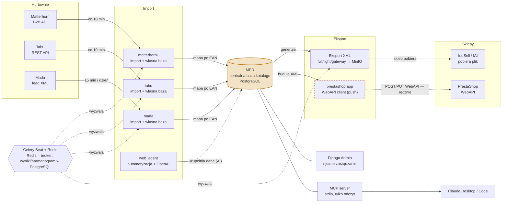

# Architektura nc_project

Skąd biorą się dane w MPD i dokąd stąd trafiają. MPD jest jedynym źródłem
prawdy o katalogu — trzy hurtownie karmią go niezależnie, dwa kanały
sprzedażowe go stamtąd czerpią, a operator i Claude czytają go z dwóch
różnych stron.

## Czytanie diagramu

- **Linie ciągłe** = automatyczny przepływ danych (import hurtowni → MPD,
  MPD → eksport).
- **Linie przerywane cienkie** (`web_agent`, `Celery → …`) = wyzwolenie/
  wsparcie w tle, nie główny przepływ danych.
- **`prestashop app`** ma przerywaną bursztynową ramkę celowo — to jedyny
  krok w całym diagramie, który dziś odpala się **ręcznie**
  (`manage.py push_prestashop_product`), nie przez Celery Beat. Automatyzacja
  tego to kolejny krok (Faza 4), jeszcze niewdrożony.
- `MPD --- ADMIN` i `MPD --- MCP` to dwa niezależne, równoległe sposoby
  czytania/zasilania tej samej bazy — człowiek przez panel, Claude przez
  lokalny serwer MCP (`apps/MPD/management/commands/run_mcp_server.py`).

## Stack

- **Bazy danych**: PostgreSQL, osobna baza per aplikacja (MPD, matterhorn1,
  tabu, mada, web_agent), routing przez `core/db_routers.py`.
- **Kolejka i harmonogram**: Celery, Redis jako broker; harmonogram i wyniki
  zadań w PostgreSQL (`django-celery-beat`, `django-celery-results`).
- **Pliki i obrazy**: MinIO (S3-kompatybilne) dla wygenerowanych plików XML
  i zdjęć produktów.
- **Środowiska**: produkcja na k3s; dev lokalnie przez docker-compose z
  tunelem SSH do bazy.
